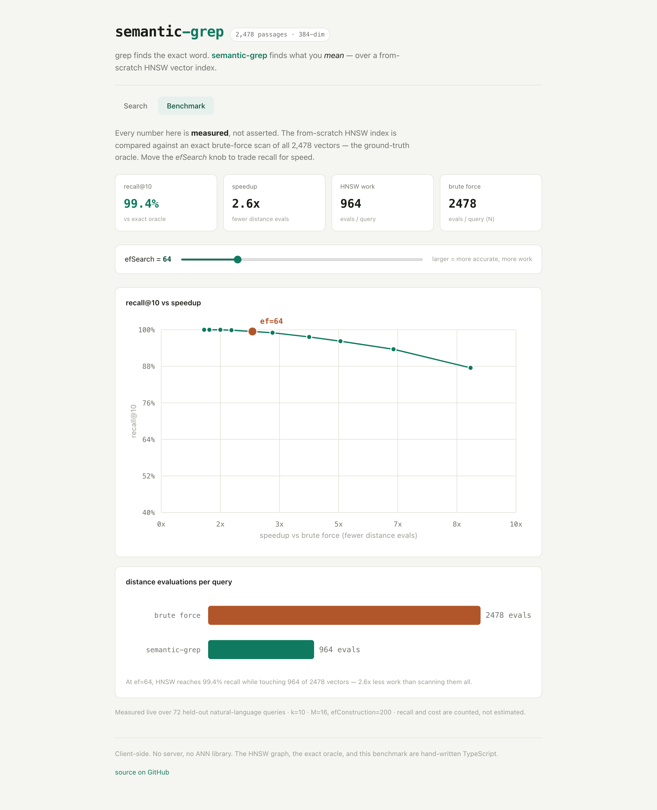
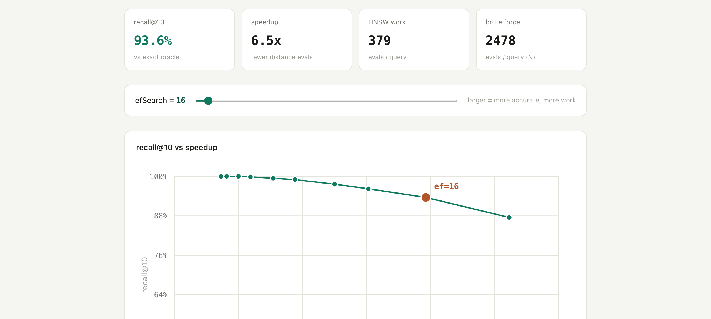

# semantic-grep

[](https://github.com/jonathon-lockridge/semantic-grep/actions/workflows/ci.yml)
[](LICENSE)

**`grep` finds the exact word. `semantic-grep` finds what you _mean_.** Search
_"how do I cancel my subscription"_ and it surfaces the passage about
_"ending your plan"_ — with **zero shared keywords**. The hard part is doing that
_fast_ over lots of text, which is exactly what real vector databases solve with
an **HNSW graph**. This repo implements that graph **from scratch** and **proves**
it works by measuring recall against exact search.

It runs entirely in your browser. No server, no ANN library.

### ▶ Live demo: **https://jonathon-lockridge.github.io/semantic-grep/**

> The demo deploys automatically via GitHub Actions on every push to `main`. If
> the link 404s, the Pages workflow hasn't completed its first run yet — it
> deploys from Settings → Pages → Source: **GitHub Actions**.

<p align="center">
  
</p>

---

## What it is

A fully client-side semantic search engine over ~2,500 passages, built on three
layers — two of which are written **from scratch**, with no nearest-neighbour or
vector-search library:

1. **Embeddings** _(allowed dependency)_ — a small quantized
   [all-MiniLM-L6-v2](https://huggingface.co/sentence-transformers/all-MiniLM-L6-v2)
   sentence model via [transformers.js](https://github.com/huggingface/transformers.js).
   The corpus is embedded once at build time and committed; only your live query
   is embedded at runtime (and the model is bundled for offline use).
2. **HNSW index** _(from scratch — the centerpiece)_ — a Hierarchical Navigable
   Small World graph (Malkov & Yashunin, 2016): probabilistic layer assignment,
   the neighbour-selection heuristic, bidirectional linking, and the ef-search
   beam. [`src/core/hnsw.ts`](src/core/hnsw.ts).
3. **Exact brute-force KNN** _(from scratch — the oracle)_ — a linear scan that is
   the ground truth recall is measured against. [`src/core/bruteforce.ts`](src/core/bruteforce.ts).

## The proof (it's measured, not asserted)

The benchmark compares the HNSW index against the exact oracle over **72 held-out
natural-language queries**, on a corpus of **2,478 passages × 384 dims**:

| efSearch | recall@10 | distance evals / query | speedup vs brute force |
| -------: | --------: | ---------------------: | ---------------------: |
|        8 |     87.5% |                    284 |                  8.7× |
|       16 |     93.6% |                    379 |                  6.5× |
|       32 |     97.6% |                    594 |                  4.2× |
|   **64** | **99.4%** |                **964** |             **2.6×** |
|      128 |    100.0% |                  1,487 |                  1.7× |
|      256 |    100.0% |                  2,049 |                  1.2× |

Brute force costs **2,478** evaluations per query (one per vector). At the default
`efSearch=64`, HNSW reaches **99.4% recall using ~39% of the work** — and as you
turn the knob down it trades a little accuracy for a lot more speed. Recall climbs
to a perfect **1.0 by `efSearch=128`**, where the search has effectively
degenerated to exhaustive. _These exact numbers are reproducible with `npm test`._

<p align="center">
  
</p>

Drag the **`efSearch`** knob and the recall-vs-speed curve updates live:

<p align="center">
  
</p>

## How it works

```
your query  ──▶  embed (mean-pool + L2-normalize)  ──▶  384-d unit vector
                                                              │
   HNSW graph search  ◀───────────────────────────────────────┘
   greedy-descend the upper layers (ef=1), then run the
   ef-search beam at layer 0
                    │
                    ▼
         top-k passages by cosine similarity
```

A query is embedded into a unit vector. Search starts at the graph's entry point
on the top layer and greedily hops toward the query, dropping a layer at a time;
at layer 0 it runs a wider beam (`efSearch` candidates) and returns the best `k`.
Because every vector is unit-length, the inner product **is** the cosine
similarity, so "nearer" just means "higher dot product".

## How it's verified

This is the project's signature: nothing about retrieval quality is taken on
faith. The full suite is **deterministic and network-free** (`npm test`,
[`test/`](test/)):

- **Recall vs the exact oracle** — HNSW results are compared to brute-force ground
  truth and recall@k is _measured_. Asserted to clear a target at the default
  `efSearch` and to reach **1.0 at `efSearch ≥ N`**. ([`recall.test.ts`](test/recall.test.ts))
- **Efficiency proxy** — a _counted_ (not wall-clock) check that HNSW performs
  strictly fewer distance evaluations than brute force's `N` at target recall.
- **Synthetic ground truth** — tight Gaussian clusters where each point's true
  neighbours are its cluster-mates _by construction_, independent of any model.
  ([`synthetic.test.ts`](test/synthetic.test.ts))
- **Graph invariants** — degree caps, no self-loops or duplicates, bidirectional
  links, layer-0 connectivity, entry point at the max level. ([`graph.test.ts`](test/graph.test.ts))
- **Determinism** — same seed + data ⇒ byte-identical graph and identical recall;
  different seeds ⇒ a different but still-valid graph. ([`determinism.test.ts`](test/determinism.test.ts))
- **Distance + oracle** — closed-form similarity on hand-computed unit vectors and
  a hand-traced top-k with a deliberate tie. ([`distance.test.ts`](test/distance.test.ts),
  [`bruteforce.test.ts`](test/bruteforce.test.ts))

All randomness flows through a seeded PRNG ([`rng.ts`](src/core/rng.ts));
`Math.random` is never used in `src/` or `test/`.

## Conventions (so it's reproducible)

- **Similarity** — inner product of L2-normalized vectors = cosine in `[-1, 1]`;
  nearer = higher. One canonical comparator (descending similarity, ties broken by
  ascending id) is used by brute force, HNSW, and recall alike.
- **recall@k** — `mean over queries of |approx_k ∩ exact_k| / k`, both sets under
  that same comparator (so ties never make it ill-defined). `k` clamped to `N`.
- **HNSW parameters** — `M = 16`, `Mmax = M`, `Mmax0 = 2M`, `efConstruction = 200`,
  `mL = 1/ln(M)`, new-node level `l = ⌊−ln(U)·mL⌋`. `efSearch` is the exposed knob
  (default 64, clamped up to `k`).
- **Neighbour selection** — the diversifying heuristic (Malkov & Yashunin Alg. 4):
  keep a candidate only if it is closer to the base node than to any already-chosen
  neighbour. Pruning is symmetric, so links stay bidirectional. Naive "keep the M
  closest" produces a poorly connected graph and tanks recall — this is required.

## Corpus & model

- **Corpus** (`public/data/`, committed): **78** original help-center / explainer
  passages (CC0, hand-authored — these drive the keyword-free demo hits) plus
  **2,400** Simple-English-Wikipedia article intros (CC BY-SA 4.0) for scale and
  paraphrase variety. Full provenance in [`public/data/SOURCE.md`](public/data/SOURCE.md).
- **Embeddings** are **precomputed and committed** as float32 (`embeddings.bin`,
  ~3.8 MB; shape/dtype in `meta.json`). The runtime never re-embeds the corpus.
- **Model** — `Xenova/all-MiniLM-L6-v2` (quantized ONNX, ~23 MB) is **bundled**
  under `public/models/` so query embedding works offline. The benchmark and
  corpus load with **zero network**; only live arbitrary-query embedding touches
  the (bundled, then cached) model. If the model can't load, the demo falls back
  to precomputed example-query vectors and the benchmark is unaffected.

## Run it locally

```bash
npm install
npm run dev         # open the visualizer
npm test            # the deterministic, network-free proof suite
npm run typecheck   # strict TypeScript, no emit
npm run build       # production bundle

npm run prepare-corpus   # regenerate corpus + embeddings (optional; needs network)
```

No API keys, no secrets, no accounts. The tests and benchmark run with zero
network access.

## Layout

```
src/core/    rng · distance · bruteforce (oracle) · hnsw · benchmark   (DOM- and embedding-free)
src/embed/   transformers.js wrapper (the only place the model is used)
src/viz/     the Vite single-page app (search + benchmark modes)
scripts/     prepare-corpus.ts (build-time embedding) + the authored corpus
public/      bundled model + committed corpus/embeddings
test/        the verification suite
```

## License

[MIT](LICENSE) © 2026 jonathon-lockridge. Corpus and model carry their own
licenses (see [`public/data/SOURCE.md`](public/data/SOURCE.md)).
